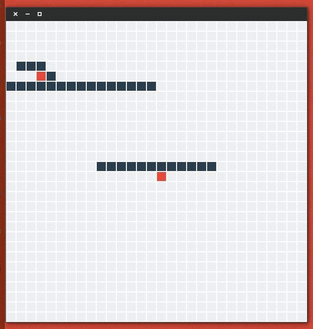

Go Dijkstra
===========

This package is just a little training aroung Go programming language. 
It comes with another package `qmlgrid` which follows the same goal.

The idea was to generate a tool able to render graphically an exploration lead by the Dijkstra
algorithm inside a grid.

Here's the result:

